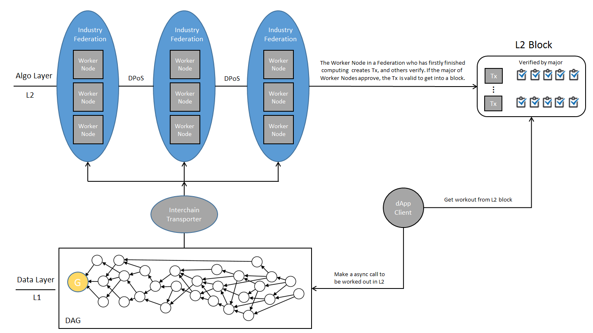

## Algone

Algone is a two-layer blockchain. By stripping time-consuming computation into a uppper layer, Algone can run smart contracts in a asynchronized way so that to support complex algorithm based applications.

## Architecture
There are two blockchains in Algone architecture. Layer 1 is a DAG, fast speeding common transactions; Layer 2 is a weakened blockchain simply running smart contracts.

## Consensus
Layer 1 achieves consensus by the witness mechanism invented by ByteBall. Layer 2 runs smart contracts in virtual machines, record the computation results in Layer 2 transactions and after verified by peer computation nodes, the transactions blended into a Layer 2 block by DPOS agent. Algone imports a transporter node into Byteball to negotiate between Layer 1 and Layer 2. 

## Application
In Artval project, which is a protocol for decentralized pricing of artworks, people vote for the price of a piece of artwork. Algone work out the final consensus price in background without consuming other transaction time.

Details for the project: https://artval.io

